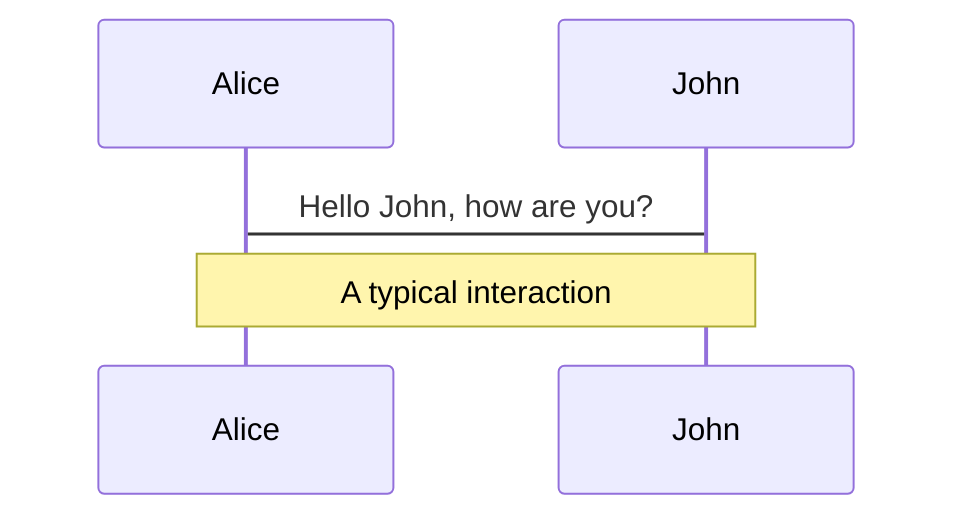
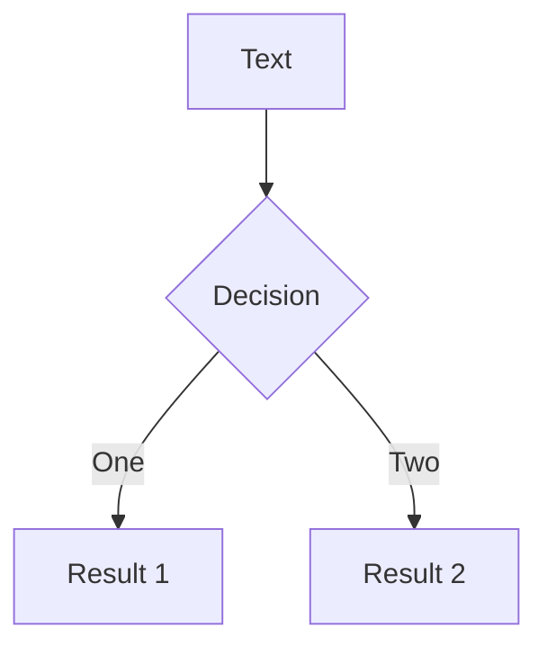
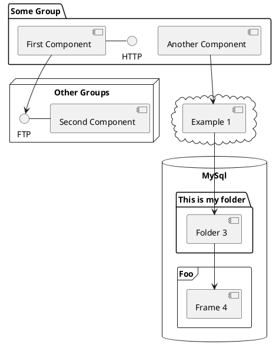

---
# try also 'default' to start simple
# theme: seriph
theme: default
# random image from a curated Unsplash collection by Anthony
# like them? see https://unsplash.com/collections/94734566/slidev
background: https://source.unsplash.com/collection/94734566/1920x1080
# apply any windi css classes to the current slide
class: 'text-center'
# https://sli.dev/custom/highlighters.html
highlighter: shiki
# show line numbers in code blocks
lineNumbers: false
# some information about the slides, markdown enabled
info: |
  ## DBFit for Data Migrations
  Presentation slides about approaching migrations with a testing methodology.

# persist drawings in exports and build
drawings:
  persist: false
# page transition
transition: slide-left
# use UnoCSS
css: unocss
---

# Testing Database (Migrations)

## with DbFit

<div class="pt-12">
  <span @click="$slidev.nav.next" class="px-2 py-1 rounded cursor-pointer" hover="bg-white bg-opacity-10">
    Press Space for next page <carbon:arrow-right class="inline"/>
  </span>
</div>

<div class="abs-br m-6 flex gap-2">
  <button @click="$slidev.nav.openInEditor()" title="Open in Editor" class="text-xl slidev-icon-btn opacity-50 !border-none !hover:text-white">
    <carbon:edit />
  </button>
</div>

<!--
The last comment block of each slide will be treated as slide notes. It will be visible and editable in Presenter Mode along with the slide. [Read more in the docs](https://sli.dev/guide/syntax.html#notes)
-->

---
transition: fade-out
---

# What is DbFit?

In essence, DbFit is a Database oriented set of fixtures that are modeled on the [Framework for integrated test](https://en.wikipedia.org/wiki/Framework_for_integrated_test) testing framework.

DbFit is an [open-source](github.org) fixture library that runs within [Fitnesse](Fitnesse.org)

- 📝 **Wiki** - a collaboration tool and testing tool combined.  Acceptence tests visible to entire team.
- <vscode-icons-file-type-excel /> **Tables** - theme can be shared and used with npm packages
- <bi-database-fill-add /> **Databases** - JDBC connectors to most databases
- <logos-java /> **Java** - library is written in java
- 🛠 **No Installation** - easy setup in CI pipelines
- <carbon-continuous-integration /> **File Based** - enables Continuous Integration processes
- <carbon-executable-program /> **Executable Documentation** - No coding necessary!


<br>
<br>

Read more about [Fitnesse](https://sli.dev/guide/why)

<!--
You can have `style` tag in markdown to override the style for the current page.
Learn more: https://sli.dev/guide/syntax#embedded-styles
-->

<style>
h1 {
  background-color: #2B90B6;
  background-image: linear-gradient(45deg, #4EC5D4 10%, #146b8c 20%);
  background-size: 100%;
  -webkit-background-clip: text;
  -moz-background-clip: text;
  -webkit-text-fill-color: transparent;
  -moz-text-fill-color: transparent;
}
</style>

<!--
Here is another comment.
-->

---
transition: fade-out
---

# Why DbFit?

Writing readable, easy to maintain unit and integration tests for database code


<br>
<br>


<!--
You can have `style` tag in markdown to override the style for the current page.
Learn more: https://sli.dev/guide/syntax#embedded-styles
-->

<style>
h1 {
  background-color: #2B90B6;
  background-image: linear-gradient(45deg, #4EC5D4 10%, #146b8c 20%);
  background-size: 100%;
  -webkit-background-clip: text;
  -moz-background-clip: text;
  -webkit-text-fill-color: transparent;
  -moz-text-fill-color: transparent;
}
</style>

<!--
Here is another comment.
-->

---

# Why (automated) testing?
- Makes application change easier
- Safety net - provides confidence/removes fear
- Documentation
- Help to localize where exactly a defect is located
- Reduce the chance of new bugs
- Automation enables earlier feedback, saves time, helps focusing on solving the main problem. (Not everything is feasible to automate)

<style>
h1 {
  background-color: #2B90B6;
  background-image: linear-gradient(45deg, #4EC5D4 10%, #146b8c 20%);
  background-size: 100%;
  -webkit-background-clip: text;
  -moz-background-clip: text;
  -webkit-text-fill-color: transparent;
  -moz-text-fill-color: transparent;
}
</style>

---

# How exactly?

- Database connections
- SQL
- DbFit Fixtures
- Test Pages
- Test Construction


---

# Database Connections


--- 

# SQL

SQL 

---

# Test Fixtures

A fixture is the DbFit class that FitNesse uses to process the wiki tables in the test.  Most often wiki tables will hold data, or parameters that the fixture code will leverage.

The **INSERT** fixture will insert the data from the table into the datbase.
The **QUERY** fixture will run sql and compare the resultset to the data in the wiki table.

---

# DbFit Core Fixtures

- Query
- Insert
- Update
- Execute Procedure
- Execute

---

# DbFit Advanced Fixtures


- Inspect queries, tables, procedures to auto-generate test tables and regression tests
- Store SQL query results and compare resultsets
- Standalone mode for full control of database transactions

---

# Test Construction 
- Arrange (set up the Fixture)
- Act (exercise the System Under Test)
- Assert (verify results are as expected)
- Tear Down the fixture (to isolate other tests from this one)

---
layout: image-right
image: https://source.unsplash.com/collection/94734566/1920x1080
---

# Code

Connection and Basic Test

```ts {all|1|5|1-6|7|8-11|all}
!path lib//*.jar

!|dbfit.SqlTest|

!|Connect|localhost|uwb_tester|uwb_psswd|dbfit_uwb_tutorial|

!|Query|SELECT * FROM people|
|name  |yob                 |
|Pavel |1961                |
|Samuel|1991                |
|Vitek |2022                |


```

<arrow v-click="2" x1="400" y1="320" x2="230" y2="230" color="#564" width="3" arrowSize="1" />

<style>
.footnotes-sep {
  @apply mt-20 opacity-10;
}
.footnotes {
  @apply text-sm opacity-75;
}
.footnote-backref {
  display: none;
}
</style>


---

# Components

<div grid="~ cols-2 gap-4">
<div>

<Youtube id="KQa3kJIyOS8" />

</div>
<div>
</div>
</div>

<!--
Presenter note with **bold**, *italic*, and ~~striked~~ text.

Also, HTML elements are valid:
<div class="flex w-full">
  <span style="flex-grow: 1;">Left content</span>
  <span>Right content</span>
</div>
-->

--- 
layout: two-cols
---

## Left

This shows on the left side

::right::

## Rightr


This shows on the right


---
class: px-20
---

# Themes

Slidev comes with powerful theming support. Themes can provide styles, layouts, components, or even configurations for tools. Switching between themes by just **one edit** in your frontmatter:

<div grid="~ cols-2 gap-2" m="-t-2">

```yaml
---
theme: default
---
```

```yaml
---
theme: seriph
---
```


</div>

Read more about [How to use a theme](https://sli.dev/themes/use.html) and
check out the [Awesome Themes Gallery](https://sli.dev/themes/gallery.html).

---
preload: false
---

# Animations

Animations are powered by [@vueuse/motion](https://motion.vueuse.org/).

```html
<div
  v-motion
  :initial="{ x: -80 }"
  :enter="{ x: 0 }">
  Slidev
</div>
```

<div class="w-60 relative mt-6">
  <div class="relative w-40 h-40">
    
    
    
  </div>

  <div
    class="text-5xl absolute top-14 left-40 text-[#2B90B6] -z-1"
    v-motion
    :initial="{ x: -80, opacity: 0}"
    :enter="{ x: 0, opacity: 1, transition: { delay: 2000, duration: 1000 } }">
    Slidev
  </div>
</div>

<!-- vue script setup scripts can be directly used in markdown, and will only affects current page -->
<script setup lang="ts">
const final = {
  x: 0,
  y: 0,
  rotate: 0,
  scale: 1,
  transition: {
    type: 'spring',
    damping: 10,
    stiffness: 20,
    mass: 2
  }
}
</script>

<div
  v-motion
  :initial="{ x:35, y: 40, opacity: 0}"
  :enter="{ y: 0, opacity: 1, transition: { delay: 3500 } }">

[Learn More](https://sli.dev/guide/animations.html#motion)

</div>

---

# Other Articles

- [Data Migration Testing](https://www.linkedin.com/pulse/how-automate-data-migration-testing-dbfit-15-mins-read-pathirana)
- [Data Warehouse Regression Testing ](https://www.red-gate.com/simple-talk/databases/sql-server/t-sql-programming-sql-server/using-dbfit-framework-data-warehouse-regression-testing/)
- [Azure SQL Server](https://datacadamia.com/test/dbfit/sqlserver)
- [ETL CI/CD](https://rspacesamuel.medium.com/lessons-learnt-from-running-a-data-warehouse-using-ci-cd-c44184fe57b5)
- [TDD with Oracle](https://javornikolov.github.io/tdd-with-dbfit-bgoug-201305/#1)
- [Course Tutorial](https://www.kiv.zcu.cz/~herout/db/dbfit-tutorial.pdf)
---

# Diagrams

You can create diagrams / graphs from textual descriptions, directly in your Markdown.

<div class="grid grid-cols-3 gap-10 pt-4 -mb-6">







</div>

[Learn More](https://sli.dev/guide/syntax.html#diagrams)

---
src: ./pages/multiple-entries.md
hide: false
---

---
layout: center
class: text-center
---
